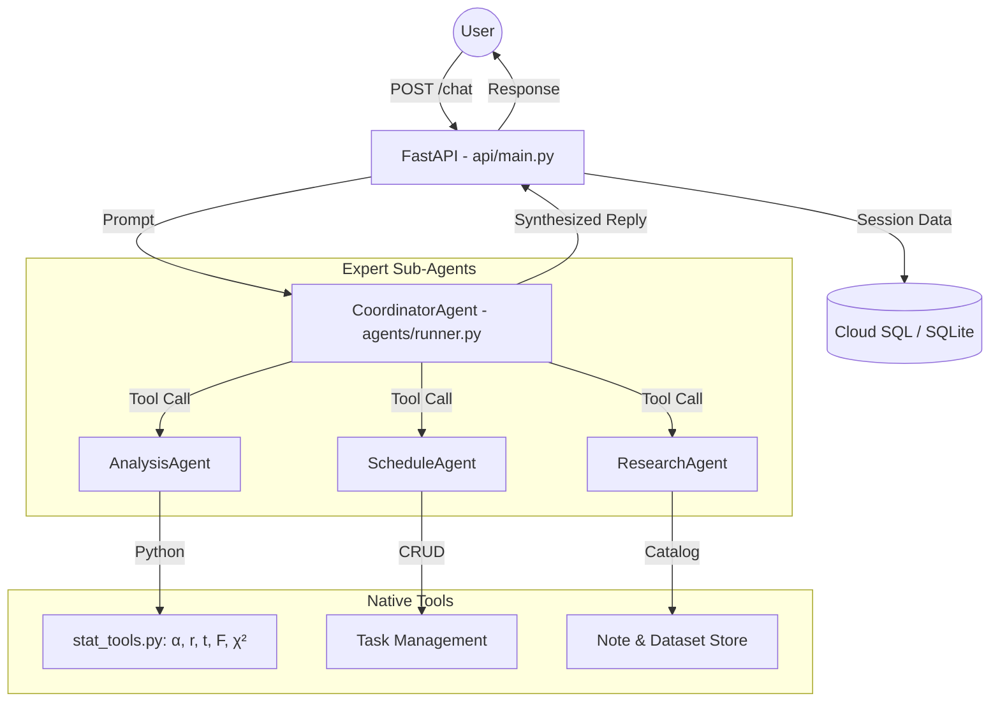

# StatMind — Multi-Agent Productivity Assistant for Statistics

> *Turning Uncertainty Into Insight* — Rf

StatMind is a production-grade multi-agent AI assistant designed to streamline the academic lifecycle of statistics students and researchers. It bridges the gap between raw data analysis, academic project management, and knowledge organization.

---

## 🚀 Key Features

*   **Multi-Agent Intelligence:** A specialized **Coordinator** routes your requests to three expert sub-agents:
    *   **Analysis Agent:** Your "Personal Statistician" for 12+ tests including Cronbach's α, ANOVA, Regression, and Normality.
    *   **Schedule Agent:** Your "Academic Project Manager" for tracking thesis milestones and deadlines.
    *   **Research Agent:** Your "Knowledge Librarian" for cataloging datasets and research notes.
*   **Production-Ready Stack:** Built with `google-genai` (Gemini 2.5 Flash), FastAPI, and Cloud SQL (PostgreSQL).
*   **Structured Data Reference:** Native support for `dataset_id:column` references, allowing the agent to perform complex stats without the user pasting raw data repeatedly.
*   **Bilingual Expertise:** Seamless support for both **English** and **Bahasa Indonesia**, matching the academic context of regional universities (like UNJ).
*   **Academic Report Export:** Generate structured analysis reports ready to be pasted directly into Word documents for thesis or journal submissions.

---

## 🏗️ Architecture



---

## 📊 Statistical Toolkit

| Category | Available Tests |
|---|---|
| **Psychometrics** | Cronbach's Alpha, Item Analysis (r_itc, α-if-deleted), KMO & Bartlett |
| **Comparison** | Independent T-Test (Welch), One-Way ANOVA, Mann-Whitney U |
| **Relationship** | Pearson Correlation, Spearman Rank Correlation, Simple Linear Regression |
| **Distribution** | Normality Tests (Shapiro-Wilk / Skewness-Kurtosis), Descriptive Stats |
| **Planning** | Sample Size Calculators (Cochran, T-test, ANOVA, Correlation) |
| **Categorical** | Chi-Square (Goodness-of-Fit & Independence) |

---

## 📂 File Structure

```text
statmind/
├── agents/
│   ├── prompts.py           # Unified system prompts for all 4 agents
│   ├── tool_declarations.py # FunctionDeclaration objects for Gemini
│   └── runner.py            # Stateless agent loop using direct google-genai client
├── api/
│   ├── main.py              # FastAPI application & session management
│   └── static/              # Frontend assets (index.html)
├── db/
│   ├── models.py            # SQLAlchemy models: ChatSession, Task, AnalysisJob, ResearchNote, Dataset
│   └── database.py          # Database engine (SQLite for dev / Cloud SQL for prod)
├── tools/
│   └── stat_tools.py        # 12+ Pure-Python statistical & management tools
├── deploy.sh                # Cloud Run deployment script
└── setup_gcp.sh             # GCP resource & IAM provisioning script
```

---

## 🛠️ Local Development

1.  **Environment Setup:**
    ```bash
    cp .env.example .env
    # Note: Vertex AI uses IAM. No GOOGLE_API_KEY needed if authenticated via gcloud.
    ```

2.  **Authenticate:**
    ```bash
    gcloud auth application-default login
    ```

3.  **Install Dependencies:**
    ```bash
    pip install -r requirements.txt
    ```

4.  **Run Application:**
    ```bash
    python -m api.main
    # Access at http://localhost:8080
    ```

---

## ☁️ Deployment (Google Cloud)

StatMind is optimized for the Google Cloud ecosystem using **Vertex AI** and **IAM-based security**:

1.  **Provision Resources:** `chmod +x setup_gcp.sh && ./setup_gcp.sh`
    *   This script creates a Service Account with `roles/aiplatform.user`.
2.  **Deploy to Cloud Run:** `chmod +x deploy.sh && ./deploy.sh`
    *   The service automatically authenticates via the assigned Service Account.
    *   No API keys are stored or managed in the cloud environment.

---

## 💡 Lessons from Evolution

StatMind was built to address critical failure points identified in earlier prototypes:
*   **Stability:** Moved from ADK-based session management to a **custom SQLAlchemy session store** to eliminate `SessionNotFoundError`.
*   **Precision:** Replaced LLM-based calculations with **native Python tool calls** to ensure zero-hallucination statistical outputs.
*   **Scalability:** Implemented a **Coordinator-Specialist pattern** to manage long-running research workflows without overwhelming the context window.
